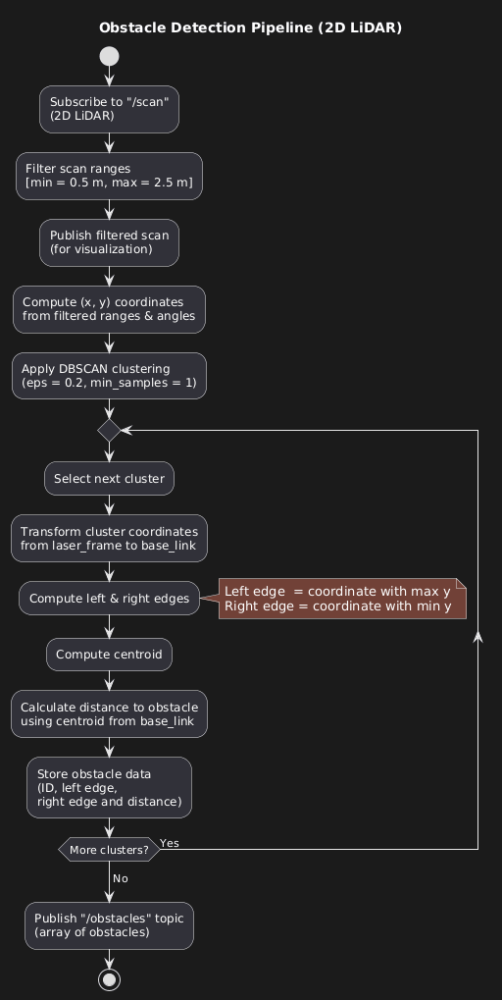
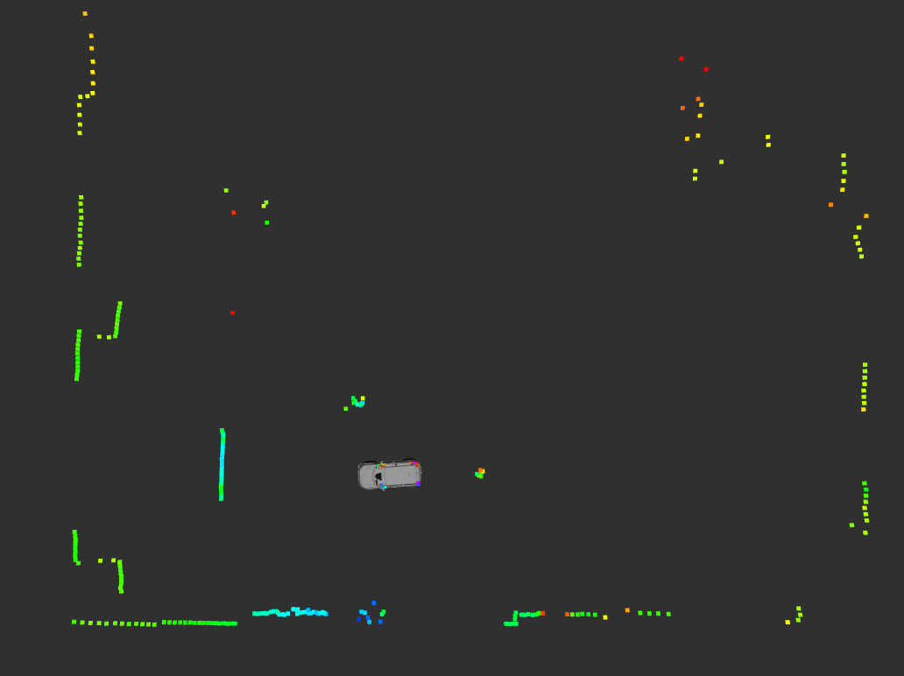
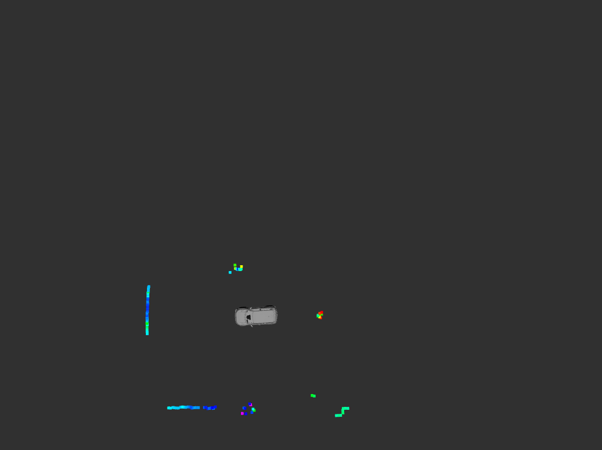
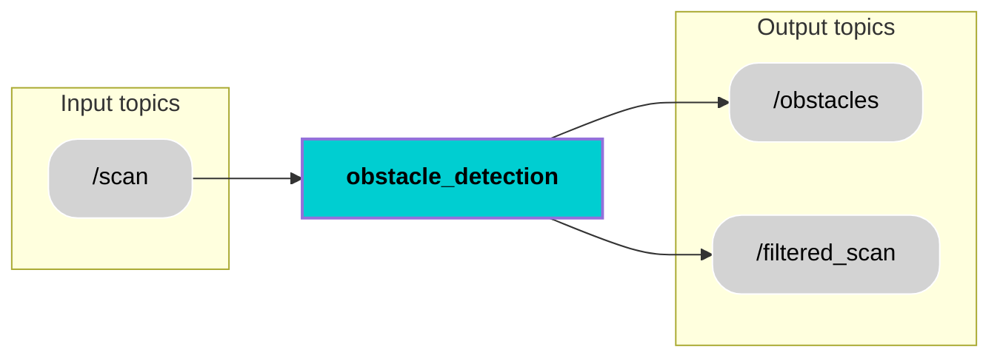

<div align="center">
  <h1 style="font-size: 36px;">Obstacle Detection</h1>
</div>

## 📚 Contents
- [Description](#-description)
- [Architecture](#-architecture)
- [Interfaces](#-interfaces)
- [Installation](#-installation)
- [Usage](#-usage)
- [License](#-license)

## 🧠 Description
The Obstacle Detection node receives its input from the 2D YDLidar sensor through the `/scan` topic. This topic publishes messages of type `sensor_msgs/LaserScan.msg`, which contain a series of distance measurements (ranges) along with corresponding angular information. These laser scan messages provide data by measuring the distance between the lidar and nearby objects at various angles. This rich set of data serves as the foundation for the obstacle detection process.

The primary functionality of the Obstacle Detection node is to interpret the Lidar data to detect and identify obstacles in the vehicle's surroundings. It processes the incoming LaserScan messages to analyze range values and detect significant discontinuities or clusters that represent physical obstacles. The component calculates the distance of these obstacles relative to the ego vehicle (base_link), filters out noise or irrelevant data, and organizes the detected objects into a structured format. This process gives the high-level information about the presence, left, right edge coordinates, and distance of obstacles around the ego vehicle.

As a result of its processing, the Obstacle Detection node publishes information on the `/obstacles` topic using messages of type `ObstacleDetectionArray.msg`. These output messages contain an array of detected obstacles along with details such as their left, right edge coordinates and distances from the ego vehicle.

### Functionality:
**Extract all the obstacles from the 2D LiDAR measurements**

| Activity Diagram | /scan and /filtered_scan |
|------------|-------------------|
|  | <br><br> |

This activity diagram illustrates a 2D LiDAR-based obstacle detection pipeline. The process begins by subscribing to the /scan topic to receive raw LiDAR data, which is then filtered to retain only ranges between 0.5 m and 2.5 m. The filtered scan is published in topic /filtered
for visualization. The corresponding Cartesian coordinates (x, y) are computed from the filtered range and angle measurements. Density-Based Spatial Clustering of Applications with Noise (DBSCAN) clustering is applied to group nearby points into distinct clusters. For each cluster, the coordinates are transformed from the laser_frame to the base_link frame. Within the transformed cluster, the left and right edges are determined based on the maximum and minimum y values, and the centroid is calculated to estimate the distance to the obstacle from base_link. The obstacle’s ID, left & right edge coordinates, and distance are stored, and once all clusters are processed, the compiled obstacle data array is published on the /obstacles topic.

## 🧩 Architecture


## 🔌 Interfaces
### Topics:
| Name                           | IO | Type                 | Description                                                              |
|------------------------------|-----|----------------------|--------------------------------------------------------------------------|
| `/scan`         | Input | `sensor_msgs/msg/LaserScan.msg`      | Provides angles and ranges                    |
| `/obstacles`           | Output | `custom_msgs/msg/ObstacleDetectionArray.msg`      | Provides obstacles ID, left & right edge coordinates and distance from base_link frame                     |
| `/filtered_scan`           | Output | `sensor_msgs/msg/LaserScan.msg`       | Provides filtered ranges and angles for visualization                     |
### Custom messages:
#### Message: `ObstacleDetectionArray.msg`
| Name                          | Type                 | Description                                                              |
|------------------------------|----------------------|--------------------------------------------------------------------------|
| `obstacles`      | `ObstacleDetectionData[]`      | Array of obstacles with unique ID, position and distance                    |

#### Message: `ObstacleDetectionData.msg`
| Name                          | Type                 | Description                                                              |
|------------------------------|----------------------|--------------------------------------------------------------------------|
| `header`          | `std_msgs/Header`    | for time and frame id   |
| `obstacle_id`       | `uint8`      |unique ID for obstacle|
| `distance`       | `float32`      | distance between obstacle and base_link                    |
| `l_x`       | `float32`      | left edge x coordinate of obstacle                    |
| `l_y`       | `float32`      | left edge y coordinate of obstacle                    |
| `r_x`       | `float32`      | right edge x coordinate of obstacle                    |
| `r_y`       | `float32`      | right edge y coordinate of obstacle                    |

## 🛠️ Installation
1. Create workspace, src and go to src
```bash
mkdir temp_ws
cd temp_ws
mkdir src
cd src
```
2. Clone component repository
```bash
git clone https://github.com/surendrakoganti/obstacle_detection.git
```
3. Clone custom messages repository
```bash
git clone https://github.com/surendrakoganti/custom_msgs.git
```
4. Return to workspace and build the packages
```bash
cd ..
colcon build
```
5. Source the setup files
```bash
source install/setup.bash
```

## ▶️ Usage
Run the node:
```bash
ros2 launch obstacle_detection obstacle_detection_launch.py
```

## License
Licensed under the **Apache 2.0 License**. See [LICENSE](LICENSE) for details.

