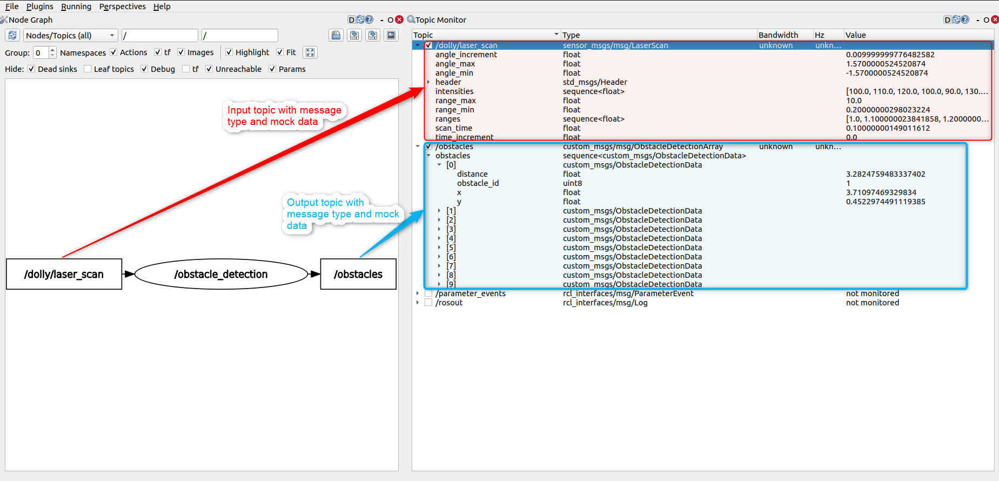

# Procedure to do interface test
1. Follow the installation and usage procedure from component repository to launch the ROS2 package
2. Execute the commands for feeding input in new terminal
    ```bash
    source install/setup.bash
    ros2 topic pub /scan sensor_msgs/LaserScan "{
        header: {
            stamp: {sec: 1750941285, nanosec: 500000000},
            frame_id: 'laser_frame'
        },
        angle_min: -1.57,
        angle_max: 1.57,
        angle_increment: 0.01,
        time_increment: 0.0,
        scan_time: 0.1,
        range_min: 0.2,
        range_max: 10.0,
        ranges: [1.0, 1.1, 1.2, 1.0, 0.9, 1.3, 1.5, 1.0, 1.2, 1.4],
        intensities: [100, 110, 120, 100, 90, 130, 150, 100, 120, 140]
        }"
    ```
3. Open RQT in new terminal
    ```bash
    source install/setup.bash
    rqt
    ```
4. Configure RQT

    Plugins -> Introspection -> Node Graph

    Plugins -> Topics -> Topic Monitor

5. Output in rqt should look like this: 
    
    
